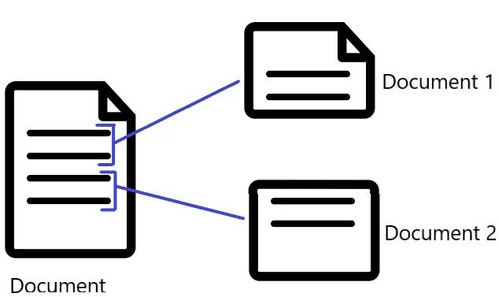
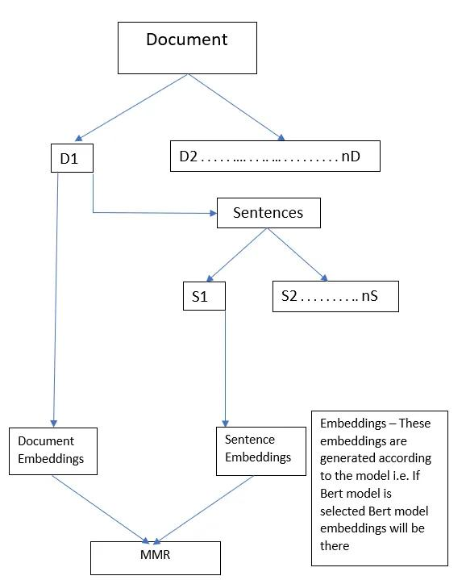
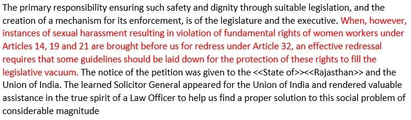

An attorney has to spend a lot of time in reading cases. When an attorney takes up a case he has to read various similar cases and prepare himself for the court. A lot of time is wasted in getting the gist of the cases as cases are very long. Key-phrase extraction will extract important key-points from the case and help in getting the gist of the case. This will not only help lawyers or attorney, but it will also be beneficial for academicians in law domain. This would contribute towards legal research tool.

Key-Phrase Extraction
---------------------

An unsupervised machine learning methodology of getting important points marked. The unsupervised system has poor F-score and does not generalize well, to tackle this we will be using EmbedRank with state of the art models(Bert, GPT-2). Generally these task lack in diversity or coverage and to tackle this we will be using MMR((Maximal Marginal Relevance) concept. In simple terms, we can understand that these tasks generate redundant phrases and sometimes does not cover the full document.

### Methodology

These legal case documents are quite big and on the other side models like Bert and GPT-2 can take up only 512 words and 1024 words respectively. We have to divide a big document into various smaller documents according to the model chosen.



Fig 1 makes the statement clear of dividing a big document into various small documents.
This method has an advantage as well as a disadvantage. The disadvantage is that full document is related and by this method, each small document acts as an independent document and has no relation among themself. The advantage of this methodology is that we can extract important key-points of a document even if the document is infinitely long.



Fig 2 represents the flow chart of how the algorithm is working. We will see the working of MMR. First of all, let us understand a few notations that will be used further explaining MMR.
**s_e**=sentence embeddings
**key_e**=Embeddings of sentences that have marked as important(Selected Sentence)
**d_e=**Document Embeddings(These will be embeddings of small documents as explained above. Large documents divided into small independent documents)
According to the model, the document length is decided(If Bert, length = 500 words, for GPT 2 = 1000 words).

### Maximal Marginal Relevance(MMR)

Let us see the mathematical equation behind this concept and see how it takes care of coverage and diversity.

> MMR=argmax[λ∗CS(d_e,s_e)−(1−λ)max(CS(s_e,key_e))]

λ= Parameter which controls the coverage and diversity. (λ towards 0 will increase diversity)
CS= Cosine Similarity

```
if λ = 1 :
MMR =argmax[λ∗CS(d_e,s_e)] [ 100 percent Coverage (May get redundant phrases) ]If λ = 0:
MMR=argmax[0−(1−λ)max(CS(s_e,key_e))]  100 percent diversity (Important points may be missed)]
```

### Code

The above code snippet represents important libraries which would be required to run the code.

These 3 functions help to extract important key-phrase.
**Key-Size** = Number of important key-points that has to be marked in the document(Small Document)

The above code snippet helps to choose the model

<b>[other]main.py[/other]</b>

The above code is self-explanatory, and comments have been added for better understanding.
If I have to explain the code in a nutshell then the code divides the document into smaller documents according to the model selected. If GPT-2 is selected it will take around 1000 words and recursively will build small documents around this word limit. The code will always end in a sentence i.e. if at 989 words the sentence end and the next sentence ends at 1030 word then it will consider it till 989. This ensures that ever small document is complete.

### Output



As the legal case is very large, so here is a small snippet of the outcome. It is just a tiny part of the full document.
**Case** — {Supreme Court of India,
Vishaka & Ors vs State Of Rajasthan & Ors on 13 August 1997}
**Case Link** — [https://indiankanoon.org/doc/1031794/](https://indiankanoon.org/doc/1031794/)

Conclusion
----------

The above-stated method extracts important key-phrases from the document. Future work could be relate embedding of small documents so that continuity could be maintained.

Thanks for reading :)
Happy Learning