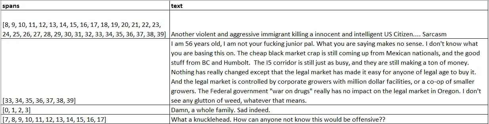
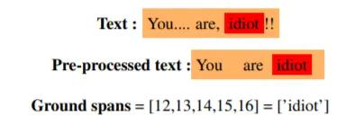
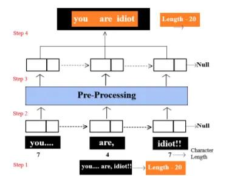
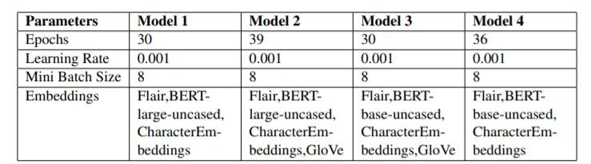
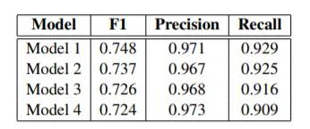
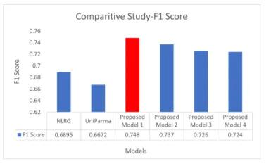
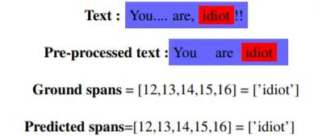

In about 60 seconds, there are 350,000 tweets, 510,000 comments, 293,000 status updates on Facebook and Twitter. In today’s time, every age group is present on these social media platforms, and it becomes vital for us to monitor the content consumed by kids nowadays. Many toxic posts and comments current on these sites need to filter for the younger generation. It is humanly impossible for these platforms to check each and everything posted by the users for hate or toxicity. This blog will walk you through an automated system for toxic spans detection. The proposed model got a 0.748 F1 score.

### **What is Toxic Spans Detection?**

A lot of people are confused between toxicity detection and toxic spans detection. It is essential to understand the difference between them.
Toxicity detection is a classification problem in which the system has to detect whether a sentence is toxic or not; this type of solution does not give much information about why the sentence was classified as toxic.
In toxic spans detection, we predict the spans i.e., words in a toxic sentence or that made the sentence toxic. Let us understand this with the help of an example:-

```
Sentence - 'What a knucklehead. How can anyone not know this would be offensive??' 
**Toxicity Detection Algo**-  "This is a toxic sentence"(Yes/1)
**Toxic Spans Detection** -[7,8,9,10,11,12,13,14,15,16,17]-> knucklehead
```

In the above example, “**Toxic Spans Detection**” provides us with the toxic spans in the sentence. There could be multiple toxic spans in a sentence that needs to identify by this automated system.

### **Dataset**

The task organizers provided the dataset ([data](https://competitions.codalab.org/competitions/25623#learn_the_details-data))(This task was a competition in Semeval 2021). Overall, 30,000 posts were picked, and out of these, 10,000 were selected randomly and were given to crowd annotators. Finally, the dataset was a CSV file that contained two columns of text and spans. Spans where character level as shown in the above example. There were a few sentences in the dataset in which there was not a toxic word, so the spans list was empty. Overall, 5897 rows were there in the CSV, from which 558 data points were extracted for testing purposes. F1score, precision, and recall were used as the evaluation metrics. The below image shows a snippet from the CSV file



### **Pre-Processing — Linked List**

The dataset provided was of social media, and hence it was essential to clean the text before passing it through our model. There were 2 major challenges in cleaning the dataset. The challenges were:-

1.  Removing unwanted characters from the original text will produce a cleaner text, and that text will be shorter in length as compared to the original text. This will create discrepancy from the spans column, as the spans are given according to the original sentence’s length.
2.  While pre-processing, it was important to maintain the sequence of the words in a sentence. For example,” You are an Idiot”, we have to make sure that after the first word” You” the second word is” are” only.

Unwanted characters were replaced with "while/null spaces" so that the length of the sentence remains the same.



In the above figure, we can see how unwanted characters are replaced with white space, which helps solve our 1st problem.

To tackle the 2nd problem, a linked-list-based approach was used. Let us try to understand this with the help of a figure.
Implementation of LinkedList data structure for pre-processing



**Step 1:** The original sentence is tokenized on ”whitespace.” In the example, the length of the original text is 20.

**Step 2:** After tokenization, each word is stored in a node of a linked list data structure, and each word from each node is pre-processed, i.e., unwanted characters are removed.

**Step 3:** To maintain the sequence of words, another linked list is made, but in this linked list, each word is cleaned. The unwanted characters are replaced with whitespaces in the pre-processing block.

**Step 4:** Words are joined back to form a proper sentence, and the length of the new sentence is 20 as it was of the original sentence.

The steps mentioned above clearly describe how we can tackle the 2nd problem using LinkedList. After pre-processing, the text was ready to feed into the machine learning model.

### Proposed Methodology

The concept of stacked embedding is applied, i.e., different embedding is stacked together to generate the result. This functionality is given by the flair ([Akbik et al., 2018a](https://www.aclweb.org/anthology/C18-1139.pdf)). Four different models with different parameters were tried. The image below shows the parameters of the different proposed models.



The concept of early stopping and adaptive learning rate was used to generate the results. The learning rate will be halved if the model does not show improvement consecutively 4 times in a row. In this case, the training automatically stops when the learning rate becomes too small, for example, LR=6.2500e-05

### Result

The below image shows the result of the 4 models proposed.



Apart from the 4 models proposed, the results were compared against the best performing model from the NLRG system ([Chhablani et al., 2021](https://arxiv.org/pdf/2102.12254.pdf)) and the UniParma system ([Karimi et al., 2021](https://arxiv.org/pdf/2103.09645.pdf)). NLRG authors have used a BERT-based RoBERTa token classification method to reach their best F1 score of 0.689. The authors of UniParma have used CharacterBERT and the bag of words(BOW) method to get their F1 score of 0.66. Proposed model 1 (highlighted in red) was the best performing model with a 0.748 F1 score



The final output of the model is shown in the below figure.



### Conclusion

The above methods help predict toxic spans in a sentence, and I believe every social media platform should have this automated system and block toxic content for the kids.
You can find the code on [Github](https://github.com/rockangator/toxic_spans_detection). The repository requires refactoring for the community to use.

Thanks for reading :)
Happy Learning